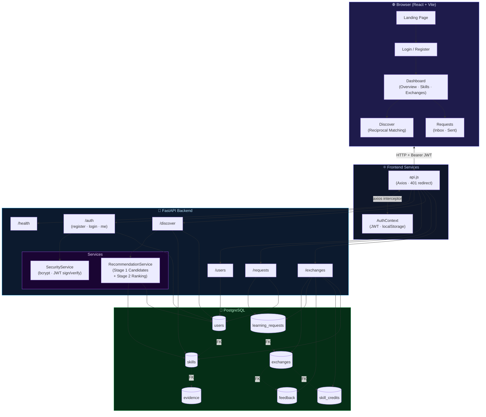

# SkillLoop — Campus Skill-Exchange Platform

SkillLoop is a modern campus skill-exchange platform where students list skills they teach, skills they want to learn, add evidence for their expertise, discover complementary peers, send learning requests, complete exchanges, and earn skill credits.

---

## Architecture Overview

| Layer | Stack |
|---|---|
| **Frontend** | React 18 · Vite · React Router v6 · Tailwind CSS · Axios · Lucide React |
| **Backend** | Python 3.11 · FastAPI · SQLAlchemy · Alembic · Pydantic v2 · JWT (python-jose) |
| **Database** | PostgreSQL (via asyncpg / psycopg2) |
| **Auth** | JWT Bearer Token — HS256 signed, 30-minute expiry |

---

## Architecture Diagram



---

## Directory Structure

```text
SkilLoop/
├── src/                           # React frontend
│   ├── components/
│   │   ├── ui/                    # Button, Card, Input, Badge
│   │   ├── layout/                # Navbar, Sidebar, Footer
│   │   ├── common/                # Header
│   │   ├── dashboard/             # ExchangeSummary
│   │   └── discover/              # RecommendationCard
│   ├── pages/
│   │   ├── Landing.jsx
│   │   ├── Login.jsx
│   │   ├── Register.jsx
│   │   ├── Dashboard.jsx          # Phase 1 + Exchanges tab wired
│   │   ├── Discover.jsx           # Phase 2 — Campus Discovery & Matching
│   │   └── Requests.jsx           # Phase 2 — Learning Requests Portal
│   ├── services/
│   │   └── api.js                 # Axios client w/ JWT + 401 redirect
│   ├── context/
│   │   └── AuthContext.jsx        # Auth state & token lifecycle
│   └── routes/
│       ├── AppRoutes.jsx
│       └── ProtectedRoute.jsx
├── backend/
│   ├── app/
│   │   ├── main.py                # FastAPI app + CORS + router mounts
│   │   ├── core/
│   │   │   ├── config.py          # Settings (env vars)
│   │   │   └── security.py        # bcrypt + JWT signing
│   │   ├── db/
│   │   │   ├── database.py        # SQLAlchemy engine & session
│   │   │   └── models/
│   │   │       ├── user.py
│   │   │       ├── skill.py
│   │   │       ├── evidence.py
│   │   │       ├── exchange.py
│   │   │       ├── learning_request.py
│   │   │       ├── feedback.py
│   │   │       └── skill_credit.py
│   │   ├── schemas/               # Pydantic models for all domains
│   │   ├── routers/               # health, auth, users, discover, requests, exchanges
│   │   └── services/
│   │       ├── auth.py
│   │       └── recommendation.py  # 2-stage reciprocal matching engine
│   ├── alembic/
│   │   └── versions/
│   │       └── 001_discovery_matching_exchanges.py
│   ├── alembic.ini
│   ├── requirements.txt
│   └── .env.example
├── index.html
├── vite.config.js
├── tailwind.config.js
└── package.json
```

---

## Running the Application

### Prerequisites
- **Python 3.11+** and **pip**
- **Node.js 18+** and **npm**
- **PostgreSQL** running locally (default port 5432)

---

### 1. Backend Server (FastAPI)

```bash
# Navigate to backend
cd backend

# Create and activate virtualenv (recommended)
python -m venv venv
# Windows:
venv\Scripts\activate
# macOS/Linux:
source venv/bin/activate

# Install Python dependencies
pip install -r requirements.txt

# Copy environment template and fill in DB credentials
cp .env.example .env
# Edit .env — set DATABASE_URL, SECRET_KEY, etc.

# Run database migrations (creates all tables)
alembic upgrade head

# Start FastAPI dev server
uvicorn app.main:app --reload --port 8000
```

- 📖 **Swagger UI** (interactive docs): [http://localhost:8000/docs](http://localhost:8000/docs)
- 💚 **Health Check**: [http://localhost:8000/api/v1/health](http://localhost:8000/api/v1/health)

---

### 2. Seed Data (Development Only)

To populate the database with test users and skills for development and demo purposes:

```bash
# From the backend/ directory (with venv active)
python -c "
from app.db.database import SessionLocal
from app.db.models.user import User
from app.db.models.skill import Skill
from app.core.security import get_password_hash
from datetime import datetime

db = SessionLocal()

# Create two test users
u1 = User(email='alice@campus.edu', full_name='Alice Fernandez', department='Computer Science',
          year_of_study='3rd Year', password_hash=get_password_hash('password123'))
u2 = User(email='bob@campus.edu', full_name='Bob Kumar', department='Data Science',
          year_of_study='2nd Year', password_hash=get_password_hash('password123'))
db.add_all([u1, u2])
db.commit()
db.refresh(u1)
db.refresh(u2)

# Assign complementary skills
db.add_all([
    Skill(user_id=u1.id, name='Python & FastAPI', category='Programming', skill_type='teach', level='Advanced'),
    Skill(user_id=u1.id, name='UI/UX Design', category='Design', skill_type='learn', level='Beginner'),
    Skill(user_id=u2.id, name='UI/UX Design', category='Design', skill_type='teach', level='Intermediate'),
    Skill(user_id=u2.id, name='Python & FastAPI', category='Programming', skill_type='learn', level='Beginner'),
])
db.commit()
db.close()
print('Seed data created: alice@campus.edu / bob@campus.edu (password: password123)')
"
```

---

### 3. Frontend Application (React + Vite)

```bash
# In the project root directory
npm install

# Start Vite dev server
npm run dev
```

- 🌐 **App**: [http://localhost:3000](http://localhost:3000)

---

## End-to-End Demo Flow

Use [Swagger UI](http://localhost:8000/docs) to walk this flow:

```
1.  POST /api/v1/auth/register        — Register User A (alice@campus.edu)
2.  POST /api/v1/auth/register        — Register User B (bob@campus.edu)
3.  POST /api/v1/auth/login           — Login as User A → copy access_token
4.  [Authorize in Swagger with User A token]
5.  POST /api/v1/skills               — Add teach skill: "Python & FastAPI" (User A)
6.  POST /api/v1/skills               — Add learn skill: "UI/UX Design" (User A)
7.  GET  /api/v1/discover             — See User B ranked as a match
8.  POST /api/v1/requests             — Send learning request to User B (receiver_id = B.id)
9.  [Switch Authorize to User B token]
10. GET  /api/v1/requests?type=received — See pending request
11. PATCH /api/v1/requests/{id}/accept  — Accept → Exchange auto-created (status: scheduled)
12. POST /api/v1/exchanges/{exchange_id}/complete  — Mark complete (duration_minutes: 60)
    → Teacher credited: +25 CR
13. POST /api/v1/exchanges/{exchange_id}/feedback  — Submit rating 1–5
14. GET  /api/v1/health               — Confirm system healthy
```

---

## API Reference (Phase 1 + 2)

| Method | Endpoint | Description | Auth |
|:---|:---|:---|:---|
| `GET` | `/api/v1/health` | System & DB health | ❌ |
| `POST` | `/api/v1/auth/register` | Register + JWT | ❌ |
| `POST` | `/api/v1/auth/login` | Login + JWT | ❌ |
| `GET` | `/api/v1/auth/me` | Authenticated user profile | ✅ |
| `PUT` | `/api/v1/users/me` | Update profile | ✅ |
| `GET` | `/api/v1/users/{id}` | Public user profile | ✅ |
| `GET` | `/api/v1/discover` | Ranked campus matches | ✅ |
| `POST` | `/api/v1/requests` | Send learning request | ✅ |
| `GET` | `/api/v1/requests` | List sent/received requests | ✅ |
| `PATCH` | `/api/v1/requests/{id}/accept` | Accept request → schedule exchange | ✅ |
| `PATCH` | `/api/v1/requests/{id}/reject` | Reject request | ✅ |
| `GET` | `/api/v1/exchanges` | List exchanges | ✅ |
| `POST` | `/api/v1/exchanges/{id}/complete` | Complete + award credits | ✅ |
| `POST` | `/api/v1/exchanges/{id}/feedback` | Submit peer feedback | ✅ |

---

## Credit Award System

| Event | Credits Awarded (to Teacher) |
|:---|:---|
| 30-minute session | +10 CR |
| 60-minute session | +20 CR |
| Session completion bonus | +5 CR |
| Verified mentor designation | +25 CR |
| **Max per session** | **50 CR** |

---

## State Machine Rules

All invalid state transitions return `409 Conflict`:

| Entity | From | Allowed To |
|:---|:---|:---|
| `LearningRequest` | `pending` | `accepted`, `rejected` |
| `LearningRequest` | `accepted` or `rejected` | ❌ (locked) |
| `Exchange` | `scheduled` | `completed` |
| `Exchange` | `completed` | ❌ (no double-complete) |
| `Feedback` | — | One per user per exchange |
| `LearningRequest` | — | No duplicate `pending` sender→receiver |
