# SkillLoop Skill Taxonomy & Evidence Verification Rubric

This document outlines the standardized 5-pillar skill taxonomy, hierarchical tree structure, and explainable rule-based evidence verification rubric designed for **SkillLoop Campus Skill Exchange**.

---

## 1. Taxonomy Structure Overview

The taxonomy is organized across **5 Root Pillars** with up to 3 levels of depth:
1. **Technical** (Software Systems, Algorithms, Emerging AI)
2. **Creative** (Design Systems, 3D, Video & Motion)
3. **Knowledge** (CS Foundations, Math, Quant Finance, Academic Writing)
4. **Professional** (Agile Leadership, Tech Interview Prep, Public Speaking)
5. **Practical** (Linux Shell, Git Workflows, Hardware Prototyping, Prompt Engineering)

```mermaid
graph TD
    Root[SkillLoop Taxonomy] --> Tech[1. Technical]
    Root --> Creat[2. Creative]
    Root --> Know[3. Knowledge]
    Root --> Prof[4. Professional]
    Root --> Pract[5. Practical]

    Tech --> AI_ML[AI & Machine Learning]
    AI_ML --> ML_Deep[↳ Machine Learning]
    ML_Deep --> ML1[Supervised & Unsupervised Learning]
    ML_Deep --> ML2[Deep Learning & Neural Networks]
    ML_Deep --> ML3[Computer Vision OpenCV & YOLO]
    ML_Deep --> ML4[Natural Language Processing Transformers]
    ML_Deep --> ML5[MLOps & Model Deployment]

    Tech --> SWE[Software Engineering]
    SWE --> SWE1[Full-Stack Web Development]
    SWE --> SWE2[REST & GraphQL API Architecture]
    SWE --> SWE3[Database Engineering & SQL]
    SWE --> SWE4[Cloud & Docker Containerization]
    SWE --> SWE5[Cybersecurity & Web App Security]

    Creat --> Design[UI/UX & Product Design]
    Design --> D1[UI/UX Design & Prototyping Figma]
    Design --> D2[User Research & Usability Testing]
    Design --> D3[Design Systems & Token Architecture]

    Creat --> Media[Media & Animation]
    Media --> M1[3D Modeling & Rendering Blender]
    Media --> M2[Video Editing & Post-Production]
    Media --> M3[Motion Graphics After Effects]
    Media --> M4[Digital Illustration & Branding]

    Know --> CSF[CS Foundations]
    CSF --> K1[Data Structures & Advanced Algorithms]
    CSF --> K2[Operating Systems & Concurrency]

    Know --> Math[Mathematics & Quant Finance]
    Math --> K3[Linear Algebra & Vector Calculus]
    Math --> K4[Probability & Statistical Inference]
    Math --> K5[Quantitative Financial Modeling]
    Math --> K6[Academic Writing & Research Methods]

    Prof --> Career[Career & Communication]
    Career --> P1[Tech Interview & System Design Prep]
    Career --> P2[Public Speaking & Pitch Presentations]
    Career --> P3[Technical Writing & Documentation]

    Prof --> Mgmt[Product & Leadership]
    Mgmt --> P4[Agile & Scrum Project Management]
    Mgmt --> P5[Product Discovery & User Validation]
    Mgmt --> P6[Technical Team Leadership]

    Pract --> DevOps[Developer Tooling & Linux]
    DevOps --> PR1[Git & Open Source Collaboration]
    DevOps --> PR2[Linux Command Line & Bash Automation]
    DevOps --> PR3[CI/CD Workflows GitHub Actions]

    Pract --> Hard[Hardware & Emerging Tech]
    Hard --> PR4[Arduino & Raspberry Pi Prototyping]
    Hard --> PR5[Prompt Engineering & LLM Workflows]
    Hard --> PR6[PCB Design & Circuit Fabrication]
```

---

## 2. Complete Taxonomy Catalog (Names & Category IDs)

### 1. Technical
- **Root Category**: `Technical` (`id: 1`)
  - **Subcategory (Level 2)**: `AI & Machine Learning` (`id: 2`, parent: 1)
    - **Subcategory (Level 3)**: `Machine Learning` (`id: 3`, parent: 2)
      - `Supervised & Unsupervised Learning`
      - `Deep Learning & Neural Networks`
      - `Computer Vision (OpenCV & YOLO)`
      - `Natural Language Processing (Transformers)`
      - `MLOps & Model Deployment`
  - **Subcategory (Level 2)**: `Software Engineering` (`id: 4`, parent: 1)
    - `Python`
    - `Full-Stack Web Development`
    - `REST & GraphQL API Architecture`
    - `Database Engineering & SQL`
    - `Cloud & Docker Containerization`
    - `Cybersecurity & Web App Security`

### 2. Creative
- **Root Category**: `Creative` (`id: 5`)
  - **Subcategory (Level 2)**: `UI/UX & Product Design` (`id: 6`, parent: 5)
    - `UI/UX Design`
    - `UI/UX Design & Prototyping (Figma)`
    - `User Research & Usability Testing`
    - `Design Systems & Token Architecture`
  - **Subcategory (Level 2)**: `Media & Animation` (`id: 7`, parent: 5)
    - `3D Modeling & Rendering (Blender)`
    - `Video Editing & Post-Production`
    - `Motion Graphics (After Effects)`
    - `Digital Illustration & Branding`

### 3. Knowledge
- **Root Category**: `Knowledge` (`id: 8`)
  - **Subcategory (Level 2)**: `CS Foundations` (`id: 9`, parent: 8)
    - `Data Structures & Advanced Algorithms`
    - `Operating Systems & Concurrency`
  - **Subcategory (Level 2)**: `Mathematics & Quant Finance` (`id: 10`, parent: 8)
    - `Linear Algebra & Vector Calculus`
    - `Probability & Statistical Inference`
    - `Quantitative Financial Modeling`
    - `Academic Writing & Research Methods`

### 4. Professional
- **Root Category**: `Professional` (`id: 11`)
  - **Subcategory (Level 2)**: `Career & Communication` (`id: 12`, parent: 11)
    - `Tech Interview & System Design Prep`
    - `Public Speaking & Pitch Presentations`
    - `Technical Writing & Documentation`
  - **Subcategory (Level 2)**: `Product & Leadership` (`id: 13`, parent: 11)
    - `Agile & Scrum Project Management`
    - `Product Discovery & User Validation`
    - `Technical Team Leadership`

### 5. Practical
- **Root Category**: `Practical` (`id: 14`)
  - **Subcategory (Level 2)**: `Developer Tooling & Linux` (`id: 15`, parent: 14)
    - `Git & Open Source Collaboration`
    - `Linux Command Line & Bash Automation`
    - `CI/CD Workflows (GitHub Actions)`
  - **Subcategory (Level 2)**: `Hardware & Emerging Tech` (`id: 16`, parent: 14)
    - `Arduino & Raspberry Pi Prototyping`
    - `Prompt Engineering & LLM Workflows`
    - `PCB Design & Circuit Fabrication`

---

## 3. Evidence Verification & Confidence Scoring Formula

The confidence score $C \in [0.0, 100.0]$ is deterministic and explainable:

$$C = \min\left(100.0, \sum_{i=1}^{N} W(\text{type}_i) \times M(\text{state}_i)\right)$$

### Base Weights $W(\text{type})$:
| Evidence Type | Base Points | Typical Examples |
|---|---|---|
| `credential` | **35.0 pts** | Coursera, Udemy, LeetCode, Kaggle, university certificates |
| `project` | **30.0 pts** | GitHub repo, live deployed application, open-source PR |
| `achievement` | **25.0 pts** | Hackathon winner, contest ranking, competitive badge |
| `demo` | **20.0 pts** | Loom walkthrough, YouTube video, interactive sandbox |
| `knowledge` | **15.0 pts** | Technical blog post, Medium/Dev.to article, arXiv paper |

### Verification Multipliers $M(\text{state})$:
- `verified` ($1.0 \times$): Recognized certification domains, video demos, deployed platforms, portfolio links
- `pending` ($0.75 \times$): GitHub repositories staged for peer review & automated check
- `unverified` ($0.40 \times$): General web URLs requiring manual peer endorsement

---

## 4. REST API Endpoint Reference

| Method | Endpoint | Description | Auth Required |
|---|---|---|---|
| `GET` | `/api/v1/skills/categories` | Complete hierarchical category tree with subcategories & skills | No |
| `GET` | `/api/v1/skills` | List flat taxonomy skills (filterable by `category_id`, `q`) | No |
| `POST` | `/api/v1/users/me/skills` | Claim a skill (`skill_id`, `direction: teach \| learn`, `level`) | Yes (JWT) |
| `GET` | `/api/v1/users/{user_id}/skills` | Get claimed skills for user ID or `me` | Yes (JWT) |
| `DELETE` | `/api/v1/users/me/skills/{user_skill_id}` | Remove claimed skill | Yes (JWT) |
| `POST` | `/api/v1/skills/{user_skill_id}/evidence` | Attach evidence proof URL, type, and description | Yes (JWT) |
| `GET` | `/api/v1/skills/{user_skill_id}/evidence` | List all evidence attached to a claimed skill | Yes (JWT) |
| `PATCH` | `/api/v1/evidence/{evidence_id}/verify` | Run explainable rule-based verification & update confidence | Yes (JWT) |
